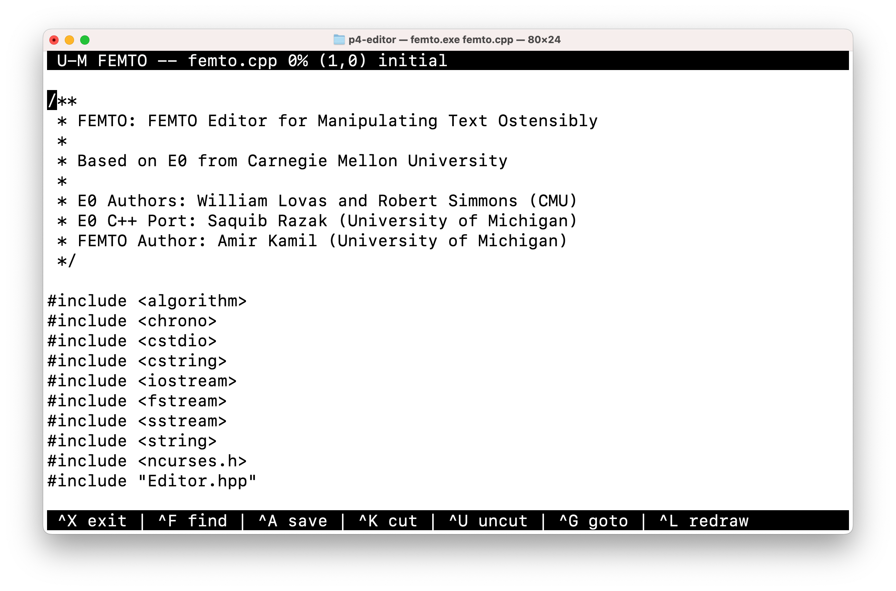
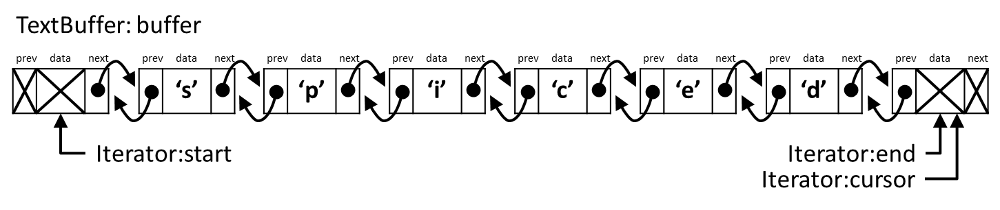
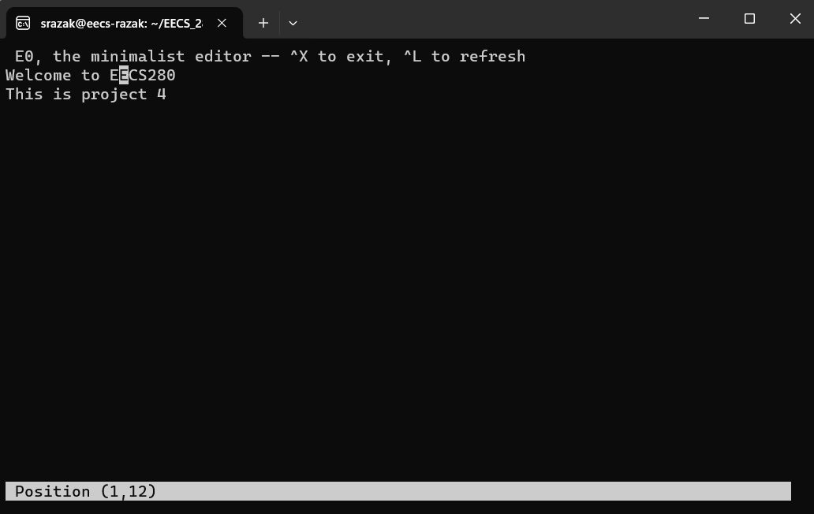

EECS 280 Project 4: Text Editor
=======================
{: .primer-spec-toc-ignore }

Due 8:00pm Tuesday April 2, 2024.  You may work alone or with a partner ([partnership guidelines](https://eecs280.org/syllabus.html#project-partnerships)).

Winter 2024 release.


## Introduction
The learning goals of this project include Container ADTs, Dynamic Memory, The Big Three, Linked Lists, and Iterators.  You will gain experience with `new` and `delete`, constructors and destructors, and the `List` data structure that is similar to `std::list` from the standard library.

When you're done, you'll have implemented the basic features of a text
editor that is usable through a terminal-based visual editor, similar
to other terminal editors such as
[Pico](https://en.wikipedia.org/wiki/Pico_(text_editor)),
[nano](https://en.wikipedia.org/wiki/GNU_nano),
[Emacs](https://en.wikipedia.org/wiki/Emacs), and
[vi](https://en.wikipedia.org/wiki/Vi_(text_editor)).



## Setup
Set up your visual debugger and version control, then submit to the autograder.

### Visual debugger
During setup, name your project `p4-editor`. Use this starter files link: `https://github.com/saquibrazak/p4-public/blob/main/p4-editor.tar.gz`

| [VS Code](https://eecs280staff.github.io/tutorials/setup_vscode.html)| [Visual Studio](https://eecs280staff.github.io/tutorials/setup_visualstudio.html) | [Xcode](https://eecs280staff.github.io/tutorials/setup_xcode.html) |

You should end up with a folder with starter files that look like this.  You may have already renamed files like `List.hpp.starter` to `List.hpp`.
```console
$ ls
Editor.hpp              List_public_test.cpp    femto.cpp
Editor_public_test.cpp  List_tests.cpp.starter  line.cpp
List.hpp.starter        Makefile                unit_test_framework.hpp
List_compile_check.cpp  e0.cpp
```
{: data-variant="no-line-numbers" }

Here's a short description of each starter file.

| File(s) | Description |
| ------- | ----------- |
| `List.hpp.starter` | Starter code for the `List` class template. |
| `List_tests.cpp.starter` | Starter code for your `List` unit tests. |
| `List_compile_check.cpp` | Compile check test for `List` |
| `List_public_test.cpp` | A very small test case for `List`. |
| `Editor.hpp` | Interface specification for the `Editor` class. |
| `Editor_public_test.cpp` | Public test cases for the `Editor` class. |
| `Makefile` | Helper commands for building. |
| `line.cpp` | A simple command line tool to test the `Editor` class. |
| `e0.cpp` | A basic visual editor for testing the `Editor` class. |
| `femto.cpp` | A more functional visual editor that uses the `Editor` class. |

### Version control
Set up version control using the [Version control tutorial](https://eecs280staff.github.io/tutorials/setup_git.html).

After you're done, you should have a local repository with a "clean" status and your local repository should be connected to a remote GitHub repository.
```console
$ git status
On branch main
Your branch is up-to-date with 'origin/main'.

nothing to commit, working tree clean
$ git remote -v
origin	https://github.com/awdeorio/p4-editor.git (fetch)
origin	https://githubcom/awdeorio/p4-editor.git (push)
```

You should have a `.gitignore` file ([instructions](https://eecs280staff.github.io/tutorials/setup_git.html#add-a-gitignore-file)).
```console
$ head .gitignore
# This is a sample .gitignore file that's useful for C++ projects.
...
```

### Group registration
Register your partnership (or working alone) on the  [Autograder](https://autograder.io/).  Then, submit the code you have.


## Linked list
Implement your doubly-linked list in `List.hpp`.  `List.hpp.starter` provides prototypes for each function.  Because `List` is a *templated* container, function implementations go in `List.hpp`.  There is no `List.cpp`.

While the `List` from lecture was singly linked, this `List` is doubly linked.
This `List` also contains an iterator interface.

Do not modify the public interface of the `List` class.  Implement a doubly-linked list.  No arrays or vectors, etc. Manage memory allocation so that there are no memory leaks ([Leak checking tutorial](https://eecs280staff.github.io/tutorials/setup_leakcheck.html)).

Compile and run the provided compile check and `List` tests.
```console
$ make List_compile_check.exe
$ make List_public_test.exe
$ ./List_public_test.exe
```

Write tests for `List` in `List_tests.cpp` using the [Unit Test Framework](https://eecs280staff.github.io/unit_test_framework/).  You'll submit these tests to the autograder.  See the [Unit Test Grading](#unit-test-grading) section.
```console
$ make List_tests.exe
$ ./List_tests.exe
```

<div class="primer-spec-callout info" markdown="1">
**Pro-tip:** Getting an error about `typename`?  Take a look at our [reference on Typename](typename.html).
</div>

### Setup
Rename these files ([VS Code (macOS)](https://eecs280staff.github.io/tutorials/setup_vscode_macos.html#rename-files), [VS Code (Windows)](https://eecs280staff.github.io/tutorials/setup_vscode_wsl.html#rename-files), [Visual Studio](https://eecs280staff.github.io/tutorials/setup_visualstudio.html#rename-files),  [Xcode](https://eecs280staff.github.io/tutorials/setup_xcode.html#rename-files), [CLI](https://eecs280staff.github.io/tutorials/cli.html#mv)):
-  `List.hpp.starter` -> `List.hpp`
-  `List_tests.cpp.starter` -> `List_tests.cpp`

Edit `List.hpp`, adding a function stub for each function prototype in `List.hpp`.  Here's an example.
```c++
template<typename T>
bool List<T>::empty() const {
  assert(false);
}
```

The List tests should compile and run. The public tests will fail until you implement the functions.  The file for your test cases (`List_tests.cpp`) will pass because it initially only contains `ASSERT_TRUE(true)`.
```console
$ make List_public_test.exe
$ ./List_public_test.exe
$ make List_tests.exe
$ ./List_tests.exe
```

At this point, we haven't written the List Iterator, so `List_compile_check.exe` won't compile.  You'll need to take a look at the lecture about iterators and write your own tests.  After you do, use the provided compile check like this:
```console
$ make List_compile_check.exe
```

Configure your IDE to debug either the public tests or your own tests.

<table>
<thead>
<tr>
  <th></th>
  <th>
  Public tests
  </th>
  <th>
  Your own tests
  </th>
</tr>
</thead>
<tbody>
<tr>
  <td>
  <b>VS Code (macOS)</b>
  </td>
  <td markdown="1">
  Set [program name](https://eecs280staff.github.io/tutorials/setup_vscode_macos.html#edit-launchjson-program) to: <br>
  `${workspaceFolder}/List_public_test.exe`
  </td>
  <td markdown="1">
  Set [program name](https://eecs280staff.github.io/tutorials/setup_vscode_macos.html#edit-launchjson-program) to: <br>
  `${workspaceFolder}/List_tests.exe`
  </td>
</tr>
<tr>
  <td>
  <b>VS Code (Windows)</b>
  </td>
  <td markdown="1">
  Set [program name](https://eecs280staff.github.io/tutorials/setup_vscode_wsl.html#edit-launchjson-program) to: <br>
  `${workspaceFolder}/List_public_test.exe`
  </td>
  <td markdown="1">
  Set [program name](https://eecs280staff.github.io/tutorials/setup_vscode_wsl.html#edit-launchjson-program) to: <br>
  `${workspaceFolder}/List_tests.exe`
  </td>
</tr>
<tr>
  <td>
  <b>Xcode</b>
  </td>
  <td markdown="1">
  Include [compile sources](https://eecs280staff.github.io/tutorials/setup_xcode.html#compile-sources): <br>
  `List_public_test.cpp`, `List.hpp`
  </td>
  <td markdown="1">
  Include [compile sources](https://eecs280staff.github.io/tutorials/setup_xcode.html#compile-sources): <br>
  `List_tests.cpp`, `List.hpp`
  </td>
</tr>
<tr>
  <td>
  <b>Visual Studio</b>
  </td>
  <td markdown="1">
  [Exclude files](https://eecs280staff.github.io/tutorials/setup_visualstudio.html#exclude-files-from-build) from the build: <br>
  - Include `List_public_test.cpp`
  - Exclude `List_compile_check.cpp`, `List_tests.cpp`, `api.cpp`, `main.cpp` (if present)
  </td>
  <td markdown="1">
  [Exclude files](https://eecs280staff.github.io/tutorials/setup_visualstudio.html#exclude-files-from-build) from the build: <br>
  - Include `List_tests.cpp`
  - Exclude `List_compile_check.cpp`, `List_public_test.cpp`, `api.cpp`, `main.cpp` (if present)
  </td>
</tr>
</tbody>
</table>

## Editor

An editor holds a sequence of characters (a *text buffer*) and at the
same time has the ability to report the current row and column (You
can display this information in Pico/nano with `Ctrl-C`, or in Emacs
by typing `M-x line-number-mode` and `M-x column-number-mode`.). The
editor also keeps track of the current cursor position where all edits
are done. In addition, the editor has the capability of scrolling
through the text using the arrow keys – the scrolling action moves the
cursor through the text. In this section, you will implement the
`Editor` class according the interface defined in the `Editor.hpp`
file. This editor should keep track of both the cursor and the row and
column position.

We will use doubly-linked lists of characters (either your
implementation from [part 1](#linked-list) or the one from the
standard library) to hold the contents of an editor. An *editable
sequence* is represented in memory by a `TextBuffer` implemented as a
doubly-linked list and an iterator that indicates the current position
of the cursor. To determine the beginning and end of the text buffer,
**add two sentinel nodes** (with character value set to ``0``) – we will
not consider these two sentinel nodes as part of our editable text.
Since an editor only allows adding and removing characters just before
the cursor, we will **limit the cursor so that it never points to the
start sentinel node but can point to the end sentinel node**. The
definition of the ``Editor`` class is shown below:

```c++
class Editor {
  using TextBuffer = List<char>;//std::list<char>;
  using Iterator = List<char>::Iterator;//std::list<char>::iterator;
private:
  TextBuffer buffer;       // linked list that contains the characters
  Iterator cursor;         // current position within the list
  int row;                 // current row
  int column;              // current column
  Iterator start_sentinel; // sentinel node at the start of the list
  Iterator end_sentinel;   // sentinel node at the end of the list
  // ... public interface not shown
};
```

We use `TextBuffer` as a *type alias* for either `List<char>`, or
`std::list<char>` (your choice), representing a doubly-linked list of
characters. We also use two iterators `start_sentinel` and 
`end_sentinel` to mark the first and the last nodes in the linked list. 
The following list contains the text ``spaces``:


To use a linked list as a text buffer, we need to keep track of the
*cursor*, which represents the position where edits can be made in the
buffer. In many visual text editors, the cursor appears as a black
rectangle, so that if the cursor was pointing to the node containing
the character `'e'`, we'd see it displayed as


Pressing the left arrow key in a text editor moves the cursor one
character backward (to the left).


We can now draw the linked list corresponding to this text buffer
along with the cursor:


Edits in a text buffer take place to the left of the cursor. If we
press the `backspace` key in the previous picture, it will remove the
character to the left of the cursor:


Insertions also happen to the left of the cursor. If we next typed the
`i` key, that character would be entered in to the left of the
cursor.


One consequence of this design is that, in order for additions and
deletions to be made to the end of the buffer, the cursor needs to be
able to go to the right of all the text. In other words, it must be
possible for the `cursor` member variable to point to the same node
that `end_sentinel` points to. Starting from the buffer above, we can
see what that looks like from the editor's point of view:


As a doubly-linked list, this final buffer looks like this:



A new, empty text buffer containing no text has two nodes, with the
cursor at the `end_sentinel`:


### Rows and Columns

One thing we care a great deal about in a text editor is which
characters are newlines, because that is what lets us know our
position in the document: the row and column. In Emacs (and the
remaining tasks of this assignment), the first row is row 1, and the
first column is column 0. In these Emacs buffers, you can see the
(row, column) displayed in the lower-right corner:


We can calculate the column of the cursor by working backwards until
we find a newline, and we can calculate the row of the cursor by
working backwards to the beginning of the buffer and counting the
newlines. Note that in the middle example, the cursor is atop a cell
containing a newline `\n`, but the cursor is at the end of
row 1, not the beginning of row 2.

By tracking the row and column in the data structure, we can report
this information to the user without ever having to recalculate the
row. It's good to avoid this, because calculating the ``row`` every
time an edit is made can be expensive to run. You should also keep
track of the ``column`` field but sometimes you might need to
recalculate this field depending on the type of edit. Any single row
is usually relatively short (80 columns maximum, if you're using good
style), so this should be fast. Specifically, we only need to
recalculate the column when we delete a newline character or move left
from the beginning of one line to the end of the previous line.

Efficiently implement the interface functions for manipulating editors
given in the definition of the ``Editor`` class in ``Editor.hpp``.

## Testing the Editor

The `Editor` tests should compile and run. The public tests will fail
until you implement the functions. The file for your test cases
(`Editor_tests.cpp`) will pass because it initially only contains
`ASSERT_TRUE(true)`.

```console
$ make Editor_public_test.exe
$ ./Editor_public_test.exe
$ make Editor_tests.exe
$ ./Editor_tests.exe
```

### Interactive Testing

You can also test your Editor implementation interactively by
compiling and running the provided `line.cpp`, which visualizes the
contents of a text buffer.

```console
$ make line.exe
$ ./line.exe
LINE Is Not an Editor -- it just visualizes the Editor implementation.
The '<' character mimics going backwards (left arrow key)
The '>' character mimics going forwards (right arrow key)
The '#' character mimics deletion (backspace key)
The '^' character mimics going up (up arrow key)
The '!' character mimics going down (down arrow key)
The '@' character mimics a newline (enter key)
All other characters just insert that character

Give initial input (empty line quits):

```

Try entering `steady^<<<<^>>^>>^@<<@^^` as the initial input. Here are
the first few lines of the result:

```console
Give initial input (empty line quits):
steady^<<<<^>>^>>^@<<@^^
STARTING
	:(1,0 )
add   : s|	:(1,1 )
add   : st|	:(1,2 )
add   : ste|	:(1,3 )
add   : stea|	:(1,4 )
add   : stead|	:(1,5 )
add   : steady|	:(1,6 )
up    : steady|	:(1,6 )
left  : stead|y	:(1,5 )
left  : stea|dy	:(1,4 )
```

The special commands directly invoke the corresponding member
functions in the `Editor` class. If an operation cannot be performed
(e.g., invoking the `up()` member function to move the cursor up a
line when it is already at the first row), the function should leave
the text buffer **unchanged** instead of raising an error or assertion
violation.

### Visual Text Editors

The starter files include two visual frontends that use your `Editor`
class, a basic one that is useful for testing, and a more functional
one that is similar to
[Pico](https://en.wikipedia.org/wiki/Pico_(text_editor)).

<div class="primer-spec-callout warning" markdown="1">
You may need to install the
[ncurses](https://en.wikipedia.org/wiki/Ncurses) library before you
can use the visual editors. On WSL, run:

```console
$ sudo apt install libncurses5-dev
```

On macOS, run:

```console
$ brew install ncurses
```

Close your terminal and reopen your terminal.
</div>

The first visual editor is called *E0*, and you can compile and run it
as follows:

```console
$ make e0.exe
$ ./e0.exe
```

This will launch a visual editor that will allow you to type text, use
backspace to delete characters, and use the arrow and home/end keys to
navigate the text. The key combination `Ctrl-X` exits the editor.



The second visual editor is called *FEMTO*, and it provides much of
the functionality of terminal editors such as Pico. Use the following
to compile and run it:

```console
$ make femto.exe
$ ./femto.exe
```

You can also specify a filename at the command line. For instance, we
can examine the visual editor's own source code with

```console
$ ./femto.exe femto.cpp
```

You should see something like the following:


You can scroll between pages with the page-up and page-down keys (or
just the up and down keys at the top and bottom rows), and you can use
the special commands listed at the bottom – for example, `^X` means
the combination `Ctrl-X`, which you can use to exit.

## Submission and grading

Submit these files to the [autograder](https://autograder.io).
  - `List.hpp`
  - `List_tests.cpp`
  - `Editor.cpp`

This project will be autograded for correctness, comprehensiveness of
your test cases, and programming style. See the [style checking
tutorial](https://eecs280staff.github.io/tutorials/setup_style.html)
for the criteria and how to check your style automatically on CAEN.

### Testing

Check for memory leaks using the [Leak checking tutorial](https://eecs280staff.github.io/tutorials/setup_leakcheck.html).

Run all the unit tests and system tests.  This includes the public tests we provided and the unit tests that you wrote.

```console
$ make test
```

<div class="primer-spec-callout info" markdown="1">
**Pro-tip:** Run commands in parallel with `make -j`.
```console
$ make -j4 test
```
{: data-variant="no-line-numbers" }
</div>


### Unit Test Grading

We will autograde your `List` unit tests. We will **not** grade your
`Editor` tests.

Your unit tests must use the [unit test framework](https://eecs280staff.github.io/unit_test_framework/).

A test suite must complete less than 5 seconds and contain 50 or fewer `TEST()` items.  One test suite is one `_tests.cpp` file.

To grade your unit tests, we use a set of intentionally buggy instructor solutions.  You get points for catching the bugs.

1.  We compile and run your unit tests with a **correct solution**.
    - Tests that pass are **valid**.
    - Tests that fail are **invalid**, they falsely report a bug.
3.  We compile and run all of your **valid** tests against each **buggy solution**.
    - If any of your tests fail, you caught the bug.
    - You earn points for each bug that you catch.

### Requirements and restrictions

It is our goal for you to gain practice with good C++ code, classes,
and dynamic memory.

| DO                                                                                                                                                              | DO NOT                                                                                                                |
| -------------------------------------------------------------------------------------------------------------------------------------------------------------------------------------------- | -------------------------------------------------------------------------------------------------------------------------------------------------- |
| Modify `.cpp` files and `List.hpp` | Modify the signature of any public functions in `List.hpp` or `Editor.hpp`  |
| For `List`, make helper member functions private | Modify the public interface of `List` or `Editor` |
| Use any part of the STL except for containers in your `List` implementation | Use STL containers in your implementation of `List` |
| `#include` a library to use its functions | Assume that the compiler will find the library for you (some do, some don’t) |
| Use C++ strings  | Use C-strings |
| Pass large structs or classes by reference | Pass large structs or classes by value |
| Pass by const reference when appropriate | "I don’t think I’ll modify it ..." |
| Use the [Address Sanitizer](https://eecs280staff.github.io/tutorials/setup_asan.html) to check for memory errors | "It’s probably fine..." |

## Acknowledgments

This project has been adapted from the course 15-122 (Principles of
Imperative Computation) offered at Carnegie Mellon University, which
is taught in a safe subet of C called *C0*. This project was ported to
C++ by Saquib Razak.

This document is licensed under a [Creative Commons Attribution-NonCommercial 4.0 License](https://creativecommons.org/licenses/by-nc/4.0/). You're free to copy and share this document, but not to sell it.  You may not share source code provided with this document.
